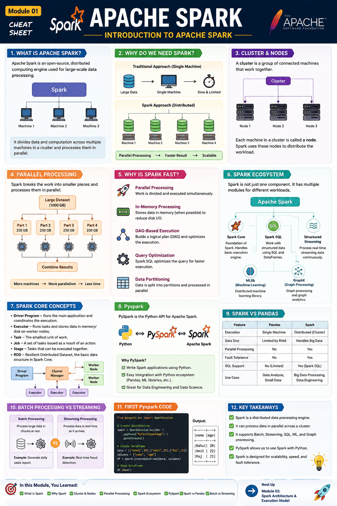
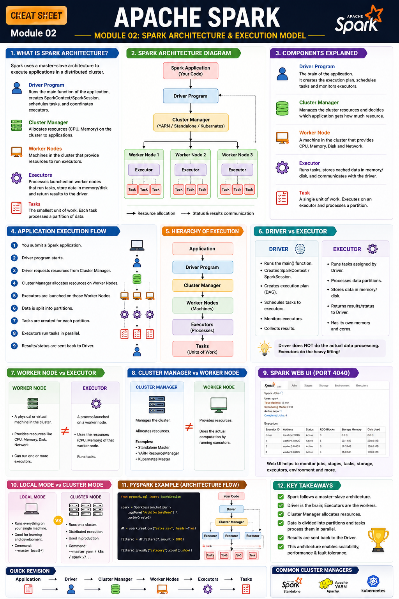
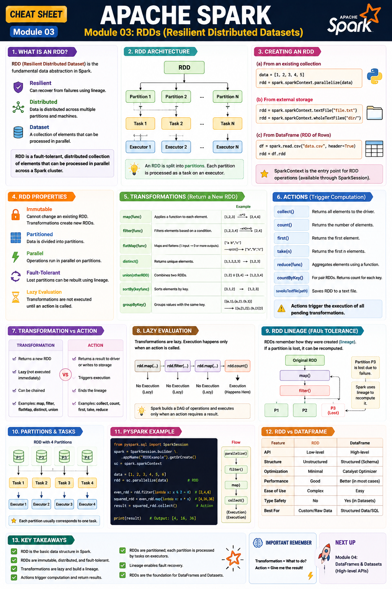

# Apache Spark — Module 01: Introduction to Apache Spark


> **Apache Spark Learning Roadmap — Module 01 of 10**
>
> This module introduces Apache Spark, distributed computing, Spark's ecosystem, PySpark, and the core ideas behind Spark.

---

## 📚 Table of Contents

- [1. What is Apache Spark?](#1-what-is-apache-spark)
- [2. Why Do We Need Spark?](#2-why-do-we-need-spark)
- [3. Distributed Computing](#3-distributed-computing)
- [4. Cluster and Nodes](#4-cluster-and-nodes)
- [5. Parallel Processing](#5-parallel-processing)
- [6. Why is Spark Fast?](#6-why-is-spark-fast)
- [7. Apache Spark Ecosystem](#7-apache-spark-ecosystem)
- [8. Spark Core](#8-spark-core)
- [9. Spark SQL](#9-spark-sql)
- [10. Structured Streaming](#10-structured-streaming)
- [11. MLlib](#11-mllib)
- [12. GraphX](#12-graphx)
- [13. Apache Spark vs PySpark](#13-apache-spark-vs-pyspark)
- [14. Spark vs Pandas](#14-spark-vs-pandas)
- [15. Batch vs Streaming](#15-batch-vs-streaming)
- [16. Basic PySpark Example](#16-basic-pyspark-example)
- [17. Important Terminology](#17-important-terminology)
- [18. Key Takeaways](#18-key-takeaways)
- [19. Module 01 Checklist](#19-module-01-checklist)
- [20. References](#20-references)

---

# 1. What is Apache Spark?

**Apache Spark** is an open-source distributed computing engine designed for large-scale data processing.

Instead of processing a huge dataset on a single machine, Spark can divide the data and computation across multiple machines in a **cluster**.

### Core idea

```text
                    Large Dataset
                         |
                    Apache Spark
                         |
          --------------------------------
          |              |               |
       Machine 1      Machine 2       Machine 3
          |              |               |
          -------- Parallel Processing ---
                         |
                       Result
```

The fundamental idea is:

> **Break a large computation into smaller tasks and execute them in parallel across a cluster.**

Apache Spark can be used for:

- Large-scale batch processing
- SQL analytics
- Data transformation
- Streaming data processing
- Machine learning
- Graph processing

---

# 2. Why Do We Need Spark?

Imagine a company has **10 TB of customer data**.

Trying to process everything on one computer can be difficult because the machine has limited:

- RAM
- CPU
- Storage
- Network bandwidth

A single-machine approach looks like:

```text
10 TB Data
    |
    v
Single Computer
    |
    v
Limited Resources
    |
    v
Processing
```

Spark allows the workload to be distributed:

```text
                       10 TB Data
                           |
                           v
                    Apache Spark
                           |
          ---------------------------------
          |               |               |
       Machine 1       Machine 2       Machine 3
        ~3.3 TB         ~3.3 TB         ~3.4 TB
          |               |               |
          ---------------+----------------
                          |
                        Result
```

This allows the workload to **scale horizontally** by using additional machines.

---

# 3. Distributed Computing

## What does "distributed" mean?

**Distributed computing** means dividing a computational workload across multiple machines that work together.

Instead of:

```text
One Machine
     |
     v
Process Everything
```

we can have:

```text
                  Large Workload
                       |
        --------------------------------
        |              |               |
     Machine 1      Machine 2       Machine 3
        |              |               |
        ----------- Partial Results -----
                       |
                       v
                  Final Result
```

### Why is this useful?

Distributed computing allows us to:

- Process datasets that are too large for one machine
- Use multiple CPUs and machines
- Perform computations in parallel
- Scale workloads horizontally
- Improve throughput

---

# 4. Cluster and Nodes

A **cluster** is a collection of machines that work together.

Each machine in a cluster is commonly called a **node**.

```text
                    Cluster
                       |
        --------------------------------
        |              |               |
      Node 1         Node 2          Node 3
        |              |               |
      CPU/RAM        CPU/RAM         CPU/RAM
```

Spark can distribute computation across these nodes.

> The detailed roles of the **Driver, Executors, Worker Nodes, and Cluster Manager** are covered in **Module 02 — Spark Architecture & Execution Model**.

---

# 5. Parallel Processing

**Parallel processing** means performing multiple computations at the same time.

Suppose we have:

```text
1,000,000 records
```

Instead of processing all records sequentially on one machine:

```text
Machine
   |
   v
1,000,000 Records
```

Spark can divide the workload:

```text
Machine 1 -> 250,000 records
Machine 2 -> 250,000 records
Machine 3 -> 250,000 records
Machine 4 -> 250,000 records
```

The different portions can be processed concurrently.

### Important relationship

```text
Large Dataset
     |
     v
Partition into smaller pieces
     |
     v
Parallel Processing
     |
     v
Combine / Produce Result
```

The actual execution details depend on Spark's execution plan, partitions, resources, and workload.

---

# 6. Why is Spark Fast?

Spark's performance comes from multiple design features. It is **not simply because Spark uses RAM**.

## 6.1 Parallel Processing

Multiple workers can process different portions of a dataset concurrently.

---

## 6.2 In-Memory Computation

Spark can keep data in memory when appropriate.

This can reduce repeated disk I/O when the same data is reused.

For example:

```text
Traditional repeated processing:

Data -> Disk -> Process
Data -> Disk -> Process
Data -> Disk -> Process
```

With suitable Spark caching:

```text
Data
 |
 v
Memory
 |
 +----> Operation 1
 |
 +----> Operation 2
 |
 +----> Operation 3
```

> **Important:** Spark is not an "in-memory-only" system. It can use memory and disk depending on the workload and configuration.

---

## 6.3 DAG-Based Execution

Spark represents many computations as a **Directed Acyclic Graph (DAG)**.

A simplified example:

```text
Read Data
    |
    v
Filter
    |
    v
Transform
    |
    v
Group
    |
    v
Result
```

This allows Spark to reason about the computation before executing it.

We will study:

- DAG
- Jobs
- Stages
- Tasks

in later modules.

---

## 6.4 Query Optimization

Spark SQL and DataFrame workloads can be optimized by Spark's SQL execution engine.

This can include:

- Query planning
- Logical optimization
- Physical planning
- Runtime optimization

We will study optimization in **Module 08 — Spark Performance & Optimization**.

---

## 6.5 Data Partitioning

Spark divides distributed data into **partitions**.

```text
             Large Dataset
                   |
       -------------------------
       |       |       |       |
      P1      P2      P3      P4
```

Partitions provide units of parallel work.

We will study partitions, shuffle, `repartition()`, and `coalesce()` in **Module 07**.

---

# 7. Apache Spark Ecosystem

Apache Spark provides a unified platform for several kinds of data workloads.

```text
                         Apache Spark
                              |
        ------------------------------------------------
        |               |              |              |
    Spark Core       Spark SQL    Structured      MLlib
                                  Streaming
        |
      GraphX
```

The major components you should know are:

| Component | Main Purpose |
|---|---|
| **Spark Core** | Fundamental distributed execution engine |
| **Spark SQL** | Structured data processing and SQL |
| **Structured Streaming** | Streaming data processing |
| **MLlib** | Distributed machine learning |
| **GraphX** | Graph processing |

---

# 8. Spark Core

**Spark Core** provides the fundamental execution capabilities of Apache Spark.

It is responsible for core concepts such as:

- Distributed task execution
- Task scheduling
- Fault tolerance
- RDDs
- Memory management
- Basic distributed computation

You can think of Spark Core as the **foundation** on which higher-level Spark APIs are built.

```text
              Spark SQL
                  |
        Structured Streaming
                  |
                MLlib
                  |
                GraphX
                  |
             Spark Core
```

---

# 9. Spark SQL

**Spark SQL** is Spark's module for working with structured data.

It provides:

- SQL queries
- DataFrames
- Structured data processing
- Query optimization
- Access to multiple data sources

Example:

```sql
SELECT department, AVG(salary)
FROM employees
GROUP BY department;
```

You can also perform similar operations using the DataFrame API.

```python
result = (
    employees
    .groupBy("department")
    .avg("salary")
)
```

Both SQL and DataFrame operations use Spark's underlying execution engine.

---

# 10. Structured Streaming

**Structured Streaming** is Spark's API for processing continuously arriving data using the structured DataFrame/SQL model.

A common architecture looks like:

```text
Real-Time Events
       |
       v
     Kafka
       |
       v
Structured Streaming
       |
       v
Transform / Aggregate
       |
       v
Database / Data Lake / Dashboard
```

Example use cases:

- Real-time analytics
- Log processing
- IoT data processing
- Fraud detection pipelines
- Monitoring systems

> Kafka and Spark are different technologies. Kafka is commonly used as a streaming source, while Spark can process the incoming stream.

Structured Streaming will be covered in **Module 10**.

---

# 11. MLlib

**MLlib** is Apache Spark's machine learning library.

It provides tools for scalable machine learning workflows.

Examples include:

- Classification
- Regression
- Clustering
- Feature engineering
- Model evaluation
- ML pipelines

A simplified workflow:

```text
Large Dataset
      |
      v
Spark DataFrame
      |
      v
Feature Engineering
      |
      v
MLlib
      |
      v
Machine Learning Model
      |
      v
Predictions
```

For an AI/ML student, MLlib is useful when machine learning needs to be performed over large datasets.

---

# 12. GraphX

**GraphX** is Spark's graph processing API.

Graphs represent entities and relationships.

Example:

```text
        User A
        /    \
       /      \
   User B ---- User C
```

Potential applications include:

- Social network analysis
- Relationship analysis
- Network analysis
- Graph algorithms

GraphX is part of Spark's ecosystem, although most modern Spark learning paths focus more heavily on Spark SQL, DataFrames, and Structured Streaming.

---

# 13. Apache Spark vs PySpark

These two terms are related but not identical.

### Apache Spark

Apache Spark is the distributed computing engine.

### PySpark

**PySpark is the Python API for Apache Spark.**

This allows Python developers to use Spark.

```text
                 Apache Spark
                      |
       --------------------------------
       |              |               |
     Scala          Java           Python
                                      |
                                   PySpark
```

If you are learning Spark using Python, most of your code will be written using **PySpark**.

---

# 14. Spark vs Pandas

Both Spark and pandas provide DataFrame-style APIs, but they are designed for different execution models.

| Feature | Pandas | Apache Spark |
|---|---|---|
| Primary focus | Local data analysis | Distributed data processing |
| Execution | Usually single machine | Distributed across a cluster |
| Scaling | Mostly vertical | Horizontal + distributed |
| DataFrame | Yes | Yes |
| SQL engine | No native distributed SQL engine | Spark SQL |
| Distributed processing | No | Yes |
| Large-scale processing | Limited by local resources | Designed for large-scale workloads |
| Python support | Native | PySpark |
| Typical use | EDA, data analysis | Big data, ETL, analytics, streaming |

### Important

Do not memorize:

> `pandas = small data` and `Spark = big data`

That is too simplistic.

A better mental model is:

> **pandas is primarily a local DataFrame/data-analysis library, while Spark is designed as a distributed data processing engine.**

---

# 15. Batch vs Streaming

Spark supports both batch and streaming workloads.

## Batch Processing

Data is collected and processed as a bounded dataset.

```text
Data
 |
 v
Spark
 |
 v
Process Entire Dataset
 |
 v
Result
```

Example:

> Calculate the total sales for yesterday.

---

## Streaming Processing

Data continuously arrives and is processed as it becomes available.

```text
Event 1 ----\
Event 2 -----\
Event 3 ------> Spark Streaming -> Results
Event 4 -----/
Event 5 ----/
```

Example:

> Calculate the number of orders arriving every minute.

---

## Batch vs Streaming

| Feature | Batch | Streaming |
|---|---|---|
| Data | Bounded | Continuously arriving |
| Processing | Periodic | Continuous / incremental |
| Example | Daily sales report | Live sales dashboard |
| Spark API | Spark SQL / DataFrame APIs | Structured Streaming |

---

# 16. Basic PySpark Example

PySpark can be installed with:

```bash
pip install pyspark
```

## Create a SparkSession

`SparkSession` is the main entry point for modern Spark functionality in PySpark.

```python
from pyspark.sql import SparkSession

spark = (
    SparkSession.builder
    .appName("MyFirstSparkApp")
    .getOrCreate()
)

print("Spark started!")
```

---

## Create a DataFrame

```python
from pyspark.sql import SparkSession

spark = (
    SparkSession.builder
    .appName("FirstSparkApp")
    .getOrCreate()
)

data = [
    ("Rahul", 20),
    ("Amit", 22),
    ("Raj", 21)
]

columns = ["name", "age"]

df = spark.createDataFrame(data, columns)

df.show()
```

### Output

```text
+-----+---+
| name|age|
+-----+---+
|Rahul| 20|
| Amit| 22|
|  Raj| 21|
+-----+---+
```

At this point, the goal is only to understand that PySpark lets us create and work with Spark DataFrames.

We will study DataFrames properly in **Module 04**.

---

# 17. Important Terminology

| Term | Meaning |
|---|---|
| **Apache Spark** | Distributed computing engine |
| **PySpark** | Python API for Apache Spark |
| **Cluster** | Group of machines working together |
| **Node** | Individual machine in a cluster |
| **Distributed Computing** | Computing performed across multiple machines |
| **Parallel Processing** | Multiple computations performed concurrently |
| **Partition** | A logical chunk of distributed data |
| **Spark Core** | Foundation of Spark's execution engine |
| **Spark SQL** | Structured data and SQL processing |
| **Structured Streaming** | Streaming data processing API |
| **MLlib** | Spark's machine learning library |
| **GraphX** | Spark's graph processing API |
| **DAG** | Directed Acyclic Graph representing computation |
| **PySpark** | Python interface to Spark |

---

# 18. Key Takeaways

### 1. Spark is a distributed computing engine

It is designed to process large-scale data across multiple machines.

### 2. Spark uses parallel processing

Different portions of data can be processed concurrently.

### 3. Spark can scale horizontally

Instead of relying only on a bigger machine, a workload can use more machines in a cluster.

### 4. Spark is not just an in-memory system

It can use memory and disk depending on the workload and configuration.

### 5. Spark has multiple components

The major ones are:

```text
Spark Core
Spark SQL
Structured Streaming
MLlib
GraphX
```

### 6. PySpark is the Python API

If you use Python to work with Spark, you will generally use PySpark.

### 7. DataFrames and Spark SQL are extremely important

Modern Spark development heavily uses structured APIs such as DataFrames and SQL.

---

# 19. Module 01 Checklist

- [ ] Understand what Apache Spark is
- [ ] Understand why Spark is needed
- [ ] Understand distributed computing
- [ ] Understand clusters and nodes
- [ ] Understand parallel processing
- [ ] Understand Spark's basic performance ideas
- [ ] Know Spark Core
- [ ] Know Spark SQL
- [ ] Know Structured Streaming
- [ ] Know MLlib
- [ ] Know GraphX
- [ ] Understand Apache Spark vs PySpark
- [ ] Understand Spark vs pandas
- [ ] Understand batch vs streaming
- [ ] Run a basic PySpark program
- [ ] Understand what a Spark DataFrame is at a high level

---

# 20. References

- [Apache Spark Official Website](https://spark.apache.org/)
- [Apache Spark Documentation](https://spark.apache.org/docs/latest/)
- [PySpark Documentation](https://spark.apache.org/docs/latest/api/python/)
- [Spark SQL & DataFrames](https://spark.apache.org/sql/)
- [Apache Spark History](https://spark.apache.org/history.html)

---



# Apache Spark — Module 02: Spark Architecture & Execution Model


> **Apache Spark Learning Roadmap — Module 02 of 10**
>
> This module explains how a Spark application actually runs: **Application → Driver → Cluster Manager → Worker Nodes → Executors → Tasks**.

---

## 📚 Table of Contents

- [1. Big Picture](#1-big-picture)
- [2. Spark Application](#2-spark-application)
- [3. Driver Program](#3-driver-program)
- [4. Cluster Manager](#4-cluster-manager)
- [5. Worker Node](#5-worker-node)
- [6. Executor](#6-executor)
- [7. Task](#7-task)
- [8. Complete Spark Architecture](#8-complete-spark-architecture)
- [9. How a Spark Application Runs](#9-how-a-spark-application-runs)
- [10. Driver vs Executor](#10-driver-vs-executor)
- [11. Worker Node vs Executor](#11-worker-node-vs-executor)
- [12. Cluster Manager vs Worker Node](#12-cluster-manager-vs-worker-node)
- [13. SparkSession](#13-sparksession)
- [14. Job, Stage and Task — Preview](#14-job-stage-and-task--preview)
- [15. Local Mode vs Cluster Mode](#15-local-mode-vs-cluster-mode)
- [16. PySpark Example](#16-pyspark-example)
- [17. Spark Web UI](#17-spark-web-ui)
- [18. Important Terminology](#18-important-terminology)
- [19. Key Takeaways](#19-key-takeaways)
- [20. Module 02 Checklist](#20-module-02-checklist)
- [21. References](#21-references)

---

# 1. Big Picture

When you run a Spark application, several components work together.

The simplified architecture is:

```text
                         SPARK APPLICATION
                                |
                                v
                         DRIVER PROGRAM
                                |
                                v
                         CLUSTER MANAGER
                                |
              +-----------------+-----------------+
              |                 |                 |
              v                 v                 v
         WORKER NODE       WORKER NODE       WORKER NODE
              |                 |                 |
          EXECUTOR          EXECUTOR          EXECUTOR
              |                 |                 |
          +---+---+         +---+---+         +---+---+
          |   |   |         |   |   |         |   |   |
         T1  T2  T3        T4  T5  T6        T7  T8  T9
```

### The easiest way to remember it

```text
Application
     ↓
Driver
     ↓
Cluster Manager
     ↓
Worker Nodes
     ↓
Executors
     ↓
Tasks
```

Apache Spark's official cluster overview describes Spark applications as sets of processes coordinated by the driver, with cluster managers allocating resources and executors running computations on worker nodes.  
[Apache Spark — Cluster Mode Overview](https://spark.apache.org/docs/latest/cluster-overview.html)

---

# 2. Spark Application

A **Spark Application** is a user program built using Spark.

For example:

```python
from pyspark.sql import SparkSession

spark = (
    SparkSession.builder
    .appName("SalesAnalysis")
    .getOrCreate()
)

df = spark.read.csv("sales.csv", header=True)

df.show()
```

This entire program represents a **Spark application**.

According to the Spark documentation, an application consists of a **driver program** and **executors** running on the cluster.

---

# 3. Driver Program

The **Driver Program** is the main coordinating process of a Spark application.

### Think of it as:

> 🧠 **Driver = Brain / Manager**

The driver:

- Runs the main application program
- Creates the Spark execution context
- Coordinates the application
- Creates execution plans
- Schedules tasks
- Tracks task/executor status
- Communicates with executors

Simplified:

```text
                  DRIVER
                    |
       +------------+------------+
       |            |            |
    Schedule     Coordinate    Track
      Tasks        Work        Status
```

### Important

The driver does **not** normally perform all distributed data processing itself.

Instead, it coordinates executors that perform the actual tasks.

---

# 4. Cluster Manager

A **Cluster Manager** is responsible for allocating resources for Spark applications.

Think of it as:

> 🧑‍💼 **Cluster Manager = Resource Manager**

The driver requests resources, and the cluster manager helps provide the resources needed to run executors.

Spark supports multiple cluster managers, including:

- **Standalone**
- **Hadoop YARN**
- **Kubernetes**

```text
                    DRIVER
                      |
                      v
               CLUSTER MANAGER
                      |
          +-----------+-----------+
          |           |           |
          v           v           v
       Worker      Worker      Worker
        Node        Node        Node
```

### Important distinction

The cluster manager manages/allocates resources.

It is **not the same thing as a worker node**.

---

# 5. Worker Node

A **Worker Node** is a machine in the cluster that can run application code.

Think of:

> 🖥️ **Worker Node = Machine providing resources**

A worker node provides resources such as:

- CPU
- Memory
- Network
- Storage

A worker node can host executor processes.

```text
              WORKER NODE
          +-------------------+
          |       CPU         |
          |       RAM         |
          |      Storage      |
          |                   |
          |     EXECUTOR      |
          +-------------------+
```

### Important

**Worker Node = Machine**

**Executor = Process running on that machine**

---

# 6. Executor

An **Executor** is a process launched for a Spark application on a worker node.

Think of:

> 💪 **Executor = Worker that performs computation**

Executors:

- Run Spark tasks
- Return task status/results to the driver
- Store data for the application when caching/persistence is used
- Use CPU and memory allocated to them

```text
                 WORKER NODE
                      |
                 +----------+
                 | EXECUTOR |
                 +----------+
                  /    |    \
                 /     |     \
              Task   Task   Task
```

Each Spark application gets its own executor processes.

This application-level isolation is an important part of Spark's architecture.

---

# 7. Task

A **Task** is a unit of work that is sent to an executor.

A simplified relationship is:

```text
Dataset
   |
   v
Partitions
   |
   v
Tasks
   |
   v
Executors
```

For example:

```text
Large Dataset
     |
     +------ Partition 1 → Task 1
     |
     +------ Partition 2 → Task 2
     |
     +------ Partition 3 → Task 3
     |
     +------ Partition 4 → Task 4
```

Executors execute these tasks.

> **Task = unit of work**

The detailed relationship between **partitions, tasks, stages, and jobs** will be covered later in the roadmap.

---

# 8. Complete Spark Architecture

## Official Apache Spark Architecture Image

The Apache Spark documentation provides an official cluster architecture diagram:


**Source:** [Apache Spark Cluster Mode Overview](https://spark.apache.org/docs/latest/cluster-overview.html)

The official diagram shows the relationship between:

- Driver Program
- Cluster Manager
- Worker Nodes
- Executors
- Tasks

---

## Simplified Architecture

```text
                         +------------------+
                         | Spark Application|
                         +--------+---------+
                                  |
                                  v
                         +------------------+
                         |      Driver      |
                         |   "Coordinator"  |
                         +--------+---------+
                                  |
                                  v
                         +------------------+
                         | Cluster Manager  |
                         | "Resources"      |
                         +--------+---------+
                                  |
              +-------------------+-------------------+
              |                   |                   |
              v                   v                   v
       +-------------+     +-------------+     +-------------+
       | Worker Node |     | Worker Node |     | Worker Node |
       +------+------+     +------+------+     +------+------+
              |                   |                   |
          Executor            Executor            Executor
              |                   |                   |
          +---+---+           +---+---+           +---+---+
          |   |   |           |   |   |           |   |   |
         T1  T2  T3          T4  T5  T6          T7  T8  T9
```

---

# 9. How a Spark Application Runs

Let's understand the complete flow.

Suppose we write:

```python
df = spark.read.csv("sales.csv", header=True)

result = df.filter(df.amount > 1000)

result.show()
```

What happens?

---

## Step 1 — Application starts

Your Python program starts.

```text
Python Program
      |
      v
Spark Application
```

---

## Step 2 — Driver starts

The driver becomes the coordinator of the application.

```text
Spark Application
       |
       v
     Driver
```

---

## Step 3 — Driver connects to a cluster manager

The driver requests resources needed for the application.

```text
Driver
  |
  v
Cluster Manager
```

---

## Step 4 — Executors are launched

The cluster manager allocates resources, and executors are launched on worker nodes.

```text
Worker 1 → Executor 1
Worker 2 → Executor 2
Worker 3 → Executor 3
```

---

## Step 5 — Spark creates execution work

Spark determines the work that needs to be performed.

At a high level:

```text
Read Data
   ↓
Filter
   ↓
Show Result
```

The detailed execution planning process will be studied in later modules.

---

## Step 6 — Data is processed in partitions

Large distributed datasets are divided into partitions.

```text
sales.csv
   |
   +---- Partition 1
   +---- Partition 2
   +---- Partition 3
   +---- Partition 4
```

---

## Step 7 — Tasks are sent to executors

```text
Partition 1 → Task 1 → Executor 1
Partition 2 → Task 2 → Executor 2
Partition 3 → Task 3 → Executor 3
Partition 4 → Task 4 → Executor 1
```

The actual number of tasks and how they are scheduled depends on the application and execution plan.

---

## Step 8 — Executors perform the work

Executors process the assigned tasks using their allocated CPU and memory.

```text
Executor 1 → Task 1
Executor 2 → Task 2
Executor 3 → Task 3
```

---

## Step 9 — Status/results are reported

Executors communicate task status and relevant results back to the driver.

```text
Executor 1 ----\
Executor 2 -----+----> Driver
Executor 3 ----/
```

---

# 10. Driver vs Executor

This is one of the **most important Spark interview concepts**.

| Driver | Executor |
|---|---|
| Coordinates the Spark application | Performs computation |
| Runs the main application process | Runs tasks |
| Creates/schedules work | Executes assigned tasks |
| Tracks execution | Reports task status |
| Coordinates executors | Can cache/persist application data |
| Usually one driver per application | One or more executors per application |

### Easy memory trick

```text
DRIVER   = 🧠 BRAIN
EXECUTOR = 💪 MUSCLE
```

---

# 11. Worker Node vs Executor

Beginners often confuse these.

They are different.

### Worker Node

A **machine** that provides resources.

### Executor

A **process** running on a worker node for a particular Spark application.

```text
             Worker Node
          +----------------+
          | CPU            |
          | RAM            |
          | Storage        |
          |                |
          |   Executor     |
          +----------------+
```

A worker node can host multiple executors depending on the deployment and resource configuration.

---

# 12. Cluster Manager vs Worker Node

These are also different.

### Cluster Manager

Responsible for allocating resources to applications.

Examples:

```text
Spark Standalone
Hadoop YARN
Kubernetes
```

### Worker Node

A machine that provides the resources where application code/executors can run.

```text
              Cluster Manager
                     |
              Allocates Resources
                     |
        +------------+------------+
        |            |            |
     Worker 1     Worker 2     Worker 3
        |            |            |
    Executor     Executor     Executor
```

---

# 13. SparkSession

In modern PySpark applications, `SparkSession` is the main entry point for working with Spark's structured APIs and many Spark features.

Example:

```python
from pyspark.sql import SparkSession

spark = (
    SparkSession.builder
    .appName("MySparkApp")
    .getOrCreate()
)
```

Now `spark` can be used for operations such as:

```python
df = spark.read.csv("data.csv")
```

and:

```python
spark.sql("SELECT * FROM employees")
```

### Think of SparkSession as:

> 🚪 **The main entry point into Spark from your application.**

---

# 14. Job, Stage and Task — Preview

Spark's execution model uses several levels of work.

A simplified hierarchy is:

```text
Action
  |
  v
 Job
  |
  v
Stages
  |
  v
Tasks
```

### Job

A **job** is a parallel computation triggered by a Spark action.

Examples of actions include:

```python
df.show()
df.count()
df.collect()
df.write...
```

---

### Stage

A job is divided into stages.

Stages are groups of tasks that can execute together before a dependency boundary such as a shuffle.

---

### Task

A task is an individual unit of work sent to an executor.

```text
Job
 |
 +--- Stage 1
 |      |
 |      +--- Task
 |      +--- Task
 |      +--- Task
 |
 +--- Stage 2
        |
        +--- Task
        +--- Task
```

> We will study **Jobs → Stages → Tasks → DAG → Lazy Evaluation** in detail in Module 06.

---

# 15. Local Mode vs Cluster Mode

Spark can run locally on a single machine or across a cluster.

## Local Mode

Useful for:

- Learning
- Development
- Testing
- Small experiments

Example:

```bash
spark-submit --master local[2] app.py
```

Here Spark runs locally using two threads.

---

## Cluster Mode

In cluster mode, Spark uses resources from a cluster.

```text
              Spark Application
                     |
                   Driver
                     |
              Cluster Manager
                     |
          -----------------------
          |         |           |
       Worker    Worker      Worker
          |         |           |
       Executor  Executor   Executor
```

Spark supports deployment through:

- Standalone
- YARN
- Kubernetes

---

# 16. PySpark Example

## Create a Spark Application

```python
from pyspark.sql import SparkSession

spark = (
    SparkSession.builder
    .appName("ArchitectureDemo")
    .getOrCreate()
)

data = [
    ("A", 100),
    ("B", 200),
    ("C", 300),
    ("D", 400)
]

columns = ["name", "sales"]

df = spark.createDataFrame(data, columns)

df.show()
```

### Output

```text
+----+-----+
|name|sales|
+----+-----+
|   A|  100|
|   B|  200|
|   C|  300|
|   D|  400|
+----+-----+
```

The important point is not the DataFrame syntax yet.

The important architecture is:

```text
Your Python Code
       |
       v
Spark Application
       |
       v
Driver
       |
       v
Spark Execution
       |
       v
Executors
       |
       v
Tasks
```

---

# 17. Spark Web UI

Spark provides a Web UI for monitoring applications.

The application's UI typically runs on port **4040** when the UI is enabled and available.

You can inspect information such as:

- Jobs
- Stages
- Tasks
- Executors
- Storage
- SQL/DataFrame queries
- Resource usage

Example:

```text
http://localhost:4040
```

### Official Spark Web UI


**Source:** [Apache Spark Web UI Documentation](https://spark.apache.org/docs/latest/web-ui.html)

The Web UI is extremely useful when debugging or optimizing Spark applications.

---

# 18. Important Terminology

| Term | Meaning |
|---|---|
| **Application** | User program built using Spark |
| **Driver** | Main coordinating process |
| **Cluster Manager** | Allocates resources for applications |
| **Worker Node** | Machine capable of running application code |
| **Executor** | Process running on a worker node for an application |
| **Task** | Unit of work sent to an executor |
| **Job** | Parallel computation triggered by an action |
| **Stage** | Group of tasks within a job |
| **Partition** | Logical chunk of distributed data |
| **SparkSession** | Main entry point for modern Spark applications |
| **Cluster** | Group of machines working together |

---

# 19. Key Takeaways

### ⭐ 1. Driver = Coordinator

The driver coordinates the Spark application and schedules work.

### ⭐ 2. Executor = Computation

Executors run tasks and can store cached/persisted data for the application.

### ⭐ 3. Worker Node = Machine

A worker node provides the resources on which executors run.

### ⭐ 4. Cluster Manager = Resource Allocation

The cluster manager allocates resources to Spark applications.

### ⭐ 5. Task = Unit of Work

Tasks are the actual pieces of work executed by executors.

### ⭐ 6. Application = Driver + Executors

A useful simplified mental model is:

```text
Spark Application
     |
     +---- Driver
     |
     +---- Executors
```

### ⭐ 7. Overall execution hierarchy

```text
Application
     ↓
Driver
     ↓
Cluster Manager
     ↓
Worker Nodes
     ↓
Executors
     ↓
Tasks
```

---

# 20. Module 02 Checklist

- [ ] Understand what a Spark Application is
- [ ] Understand the Driver
- [ ] Understand the Cluster Manager
- [ ] Understand Worker Nodes
- [ ] Understand Executors
- [ ] Understand Tasks
- [ ] Understand Driver vs Executor
- [ ] Understand Worker Node vs Executor
- [ ] Understand Cluster Manager vs Worker Node
- [ ] Understand SparkSession
- [ ] Understand the basic execution flow
- [ ] Know what a Job is
- [ ] Know what a Stage is
- [ ] Know what a Task is
- [ ] Understand Local Mode vs Cluster Mode
- [ ] Know where Spark Web UI fits into development

---

# 21. References

1. [Apache Spark — Cluster Mode Overview](https://spark.apache.org/docs/latest/cluster-overview.html)
2. [Apache Spark — Documentation](https://spark.apache.org/docs/latest/)
3. [Apache Spark — Web UI](https://spark.apache.org/docs/latest/web-ui.html)
4. [Apache Spark — Configuration](https://spark.apache.org/docs/latest/configuration.html)
5. [Apache Spark — Standalone Mode](https://spark.apache.org/docs/latest/spark-standalone.html)

---



# Apache Spark — Module 03: RDDs (Resilient Distributed Datasets)


> **Apache Spark Learning Roadmap — Module 03 of 10**
>
> This module covers **RDDs, partitions, transformations, actions, lazy evaluation, immutability, lineage, fault tolerance, persistence, and basic PySpark RDD operations**.

---

## 📚 Table of Contents

- [1. What is an RDD?](#1-what-is-an-rdd)
- [2. RDD Full Form](#2-rdd-full-form)
- [3. Why Do We Need RDDs?](#3-why-do-we-need-rdds)
- [4. RDD and Partitions](#4-rdd-and-partitions)
- [5. Creating RDDs](#5-creating-rdds)
- [6. SparkContext](#6-sparkcontext)
- [7. RDD Immutability](#7-rdd-immutability)
- [8. Transformations](#8-transformations)
- [9. Common Transformations](#9-common-transformations)
- [10. Actions](#10-actions)
- [11. Transformation vs Action](#11-transformation-vs-action)
- [12. Lazy Evaluation](#12-lazy-evaluation)
- [13. RDD Lineage](#13-rdd-lineage)
- [14. Fault Tolerance](#14-fault-tolerance)
- [15. RDD Persistence and Caching](#15-rdd-persistence-and-caching)
- [16. Complete RDD Example](#16-complete-rdd-example)
- [17. Dry Run](#17-dry-run)
- [18. RDD Execution Flow](#18-rdd-execution-flow)
- [19. RDD vs DataFrame](#19-rdd-vs-dataframe)
- [20. Important RDD Terminology](#20-important-rdd-terminology)
- [21. Key Takeaways](#21-key-takeaways)
- [22. Module 03 Checklist](#22-module-03-checklist)
- [23. References](#23-references)

---

# 1. What is an RDD?

**RDD** stands for **Resilient Distributed Dataset**.

An RDD is Spark's foundational abstraction for a **distributed, immutable, partitioned collection of elements that can be processed in parallel**.

In simple terms:

> An RDD is a collection of data split into partitions so Spark can process those partitions in parallel across a cluster.

The official Spark documentation describes an RDD as a fault-tolerant collection of elements that can be operated on in parallel and is partitioned across cluster nodes.

**Official reference:** [Apache Spark — RDD Programming Guide](https://spark.apache.org/docs/latest/rdd-programming-guide.html)

---

## RDD at a glance

```text
                         RDD
                          |
             +------------+------------+
             |            |            |
         Partition 1  Partition 2  Partition 3
             |            |            |
           Task         Task         Task
             |            |            |
         Executor      Executor      Executor
```

This connects directly with **Module 02 — Spark Architecture**.

---

# 2. RDD Full Form

Let's break the name down:

## R — Resilient

RDDs are designed to recover from failures.

If a partition is lost, Spark can often recompute it using the transformations that created it.

---

## D — Distributed

The data is divided into partitions and can be processed across multiple machines.

---

## D — Dataset

An RDD represents a collection of elements.

So:

```text
Resilient
    +
Distributed
    +
Dataset
    =
RDD
```

---

# 3. Why Do We Need RDDs?

Suppose we have:

```text
100 GB Dataset
```

Processing everything as one local collection would be difficult.

Spark can divide the data:

```text
                  100 GB Dataset
                        |
                        v
              +-------------------+
              |        RDD        |
              +-------------------+
                /    |    |    \
               /     |    |     \
             P1      P2   P3      P4
             |       |    |       |
           Task    Task  Task    Task
             |       |    |       |
         Executor Executor Executor Executor
```

Each partition can be processed independently when the operation allows it.

This is what makes distributed parallel processing possible.

---

# 4. RDD and Partitions

A **partition** is a logical chunk of an RDD.

For example:

```text
RDD
 |
 +---- Partition 1 → [1, 2]
 |
 +---- Partition 2 → [3, 4]
 |
 +---- Partition 3 → [5, 6]
 |
 +---- Partition 4 → [7, 8]
```

Spark generally runs **one task per partition** for a stage.

So:

```text
Partition 1 → Task 1
Partition 2 → Task 2
Partition 3 → Task 3
Partition 4 → Task 4
```

The number of partitions is therefore important for parallelism.

> The exact partition count depends on how the RDD is created, the input source, and the configuration.

The official RDD guide explains that Spark runs one task for each partition and allows the partition count to be controlled for parallelized collections.

---

## Official Spark Architecture Visual


This official Spark diagram is useful for connecting **RDD partitions → tasks → executors → worker nodes**.

**Source:** [Apache Spark — Cluster Mode Overview](https://spark.apache.org/docs/latest/cluster-overview.html)

---

# 5. Creating RDDs

There are two fundamental ways to create RDDs.

---

## 5.1 From an Existing Collection

Use `parallelize()`.

```python
numbers = [1, 2, 3, 4, 5]

rdd = spark.sparkContext.parallelize(numbers)
```

Conceptually:

```text
Python List
    |
    v
parallelize()
    |
    v
RDD
```

You can also specify the number of partitions:

```python
rdd = spark.sparkContext.parallelize(numbers, 2)
```

---

## 5.2 From External Storage

For example:

```python
rdd = spark.sparkContext.textFile("data.txt")
```

This creates an RDD representing the lines in the file.

```text
data.txt
   |
   v
textFile()
   |
   v
RDD
```

Spark's RDD guide documents `textFile()` for creating RDDs from text files and other Hadoop-supported storage systems.

---

# 6. SparkContext

You will often see:

```python
spark.sparkContext
```

`SparkContext` is the core entry point associated with Spark's lower-level RDD API.

Example:

```python
from pyspark.sql import SparkSession

spark = (
    SparkSession.builder
    .appName("RDDDemo")
    .getOrCreate()
)

sc = spark.sparkContext

rdd = sc.parallelize([1, 2, 3, 4])
```

Conceptually:

```text
SparkSession
      |
      v
SparkContext
      |
      v
RDD API
```

### Modern PySpark practice

For modern Spark applications, `SparkSession` is generally the primary entry point, while `SparkContext` is still relevant when working directly with RDDs.

---

# 7. RDD Immutability

RDDs are **immutable**.

This means:

> Once an RDD is created, it is not directly modified.

Instead, transformations create new RDDs.

Example:

```python
numbers = [1, 2, 3, 4]

rdd = spark.sparkContext.parallelize(numbers)

doubled_rdd = rdd.map(lambda x: x * 2)
```

Conceptually:

```text
Original RDD
[1, 2, 3, 4]
      |
     map
      |
      v
New RDD
[2, 4, 6, 8]
```

The original RDD remains unchanged.

---

## Why immutability is useful

Immutability makes distributed computation easier to reason about because Spark can represent a chain of derived datasets.

```text
RDD 1
  |
  | map
  v
RDD 2
  |
  | filter
  v
RDD 3
```

This chain becomes important for **lineage and fault recovery**.

---

# 8. Transformations

RDD operations are broadly divided into:

```text
                  RDD Operations
                       |
              +--------+--------+
              |                 |
       Transformations       Actions
```

A **transformation** creates a new RDD from an existing RDD.

Examples:

```python
map()
filter()
flatMap()
distinct()
union()
mapPartitions()
```

The key point:

> **Transformations are lazy.**

They define what Spark should do, but they do not immediately execute the computation.

---

# 9. Common Transformations

## 9.1 `map()`

`map()` applies a function to every element and returns a new RDD.

```python
rdd = spark.sparkContext.parallelize([1, 2, 3, 4])

doubled = rdd.map(lambda x: x * 2)
```

Result:

```text
[2, 4, 6, 8]
```

### Mental model

```text
1 → 2
2 → 4
3 → 6
4 → 8
```

**One input → one output**

---

## 9.2 `filter()`

`filter()` keeps elements for which the condition is `True`.

```python
rdd = spark.sparkContext.parallelize([1, 2, 3, 4, 5, 6])

even_numbers = rdd.filter(lambda x: x % 2 == 0)
```

Result:

```text
[2, 4, 6]
```

### Mental model

```text
1 → ❌
2 → ✅
3 → ❌
4 → ✅
5 → ❌
6 → ✅
```

---

## 9.3 `flatMap()`

`flatMap()` can produce zero or more output elements for each input element.

Example:

```python
rdd = spark.sparkContext.parallelize([
    "hello world",
    "spark is fast"
])

words = rdd.flatMap(lambda line: line.split())
```

Result:

```text
["hello", "world", "spark", "is", "fast"]
```

### `map()` vs `flatMap()`

```text
map:
one input → one output

flatMap:
one input → zero or more outputs
```

---

## 9.4 `distinct()`

Removes duplicate elements.

```python
rdd = spark.sparkContext.parallelize([1, 2, 2, 3, 3, 3])

unique = rdd.distinct()
```

Result:

```text
[1, 2, 3]
```

---

## 9.5 `union()`

Combines two RDDs.

```python
rdd1 = spark.sparkContext.parallelize([1, 2, 3])
rdd2 = spark.sparkContext.parallelize([4, 5, 6])

combined = rdd1.union(rdd2)
```

Result:

```text
[1, 2, 3, 4, 5, 6]
```

---

## 9.6 `mapPartitions()`

`mapPartitions()` applies a function to each partition rather than each individual element.

```python
result = rdd.mapPartitions(my_function)
```

This can be useful when you want to initialize something once per partition instead of once per record.

---

# 10. Actions

An **action** triggers computation and returns a result to the driver or writes output.

Common actions include:

```python
collect()
count()
first()
take()
reduce()
```

The official Spark RDD guide defines transformations as operations that create new datasets and actions as operations that return a value to the driver after computation.

---

## 10.1 `collect()`

```python
rdd = spark.sparkContext.parallelize([1, 2, 3, 4])

result = rdd.collect()

print(result)
```

Output:

```text
[1, 2, 3, 4]
```

### ⚠️ Important

`collect()` brings **all elements** to the driver.

Therefore:

```python
rdd.collect()
```

can cause driver memory problems if the RDD is very large.

Use it only when the result is reasonably small.

---

## 10.2 `count()`

```python
rdd.count()
```

Example:

```python
rdd = spark.sparkContext.parallelize([10, 20, 30, 40])

print(rdd.count())
```

Output:

```text
4
```

---

## 10.3 `first()`

Returns the first element.

```python
rdd.first()
```

---

## 10.4 `take(n)`

Returns the first `n` elements.

```python
rdd.take(3)
```

Example result:

```text
[10, 20, 30]
```

---

## 10.5 `reduce()`

Combines elements using a function.

```python
rdd = spark.sparkContext.parallelize([1, 2, 3, 4])

total = rdd.reduce(lambda a, b: a + b)

print(total)
```

Output:

```text
10
```

---

# 11. Transformation vs Action

This distinction is one of the most important concepts in Spark.

| Transformation | Action |
|---|---|
| Creates a new RDD | Produces a result / writes output |
| Lazy | Triggers execution |
| `map()` | `collect()` |
| `filter()` | `count()` |
| `flatMap()` | `first()` |
| `distinct()` | `take()` |
| `union()` | `reduce()` |

### Easy memory trick

> **Transformation = "What should Spark do?"**

> **Action = "Now give me the result."**

---

# 12. Lazy Evaluation

Spark uses **lazy evaluation** for transformations.

Suppose:

```python
rdd = spark.sparkContext.parallelize([1, 2, 3, 4])

doubled = rdd.map(lambda x: x * 2)

filtered = doubled.filter(lambda x: x > 4)
```

At this point, Spark has recorded the transformations.

```text
RDD
 |
 | map
 v
RDD
 |
 | filter
 v
RDD
```

The computation is triggered when an action is called:

```python
filtered.collect()
```

Then Spark executes the required work.

---

## Why Lazy Evaluation?

Lazy evaluation allows Spark to build a better execution plan and avoid unnecessary intermediate computation.

For example:

```text
Read
 ↓
Map
 ↓
Filter
 ↓
Reduce
```

Instead of immediately materializing every intermediate dataset, Spark can reason about the sequence of operations and execute the required computation when an action needs the result.

---

## Complete Lazy Evaluation Flow

```text
Transformation
      ↓
Transformation
      ↓
Transformation
      ↓
      ...
      ↓
    Action
      ↓
Spark executes computation
```

The official RDD programming guide explicitly describes Spark transformations as lazy and explains that they are computed when an action requires a result.

---

# 13. RDD Lineage

**Lineage** is the chain of transformations used to create an RDD.

Example:

```python
rdd1 = sc.parallelize([1, 2, 3, 4])

rdd2 = rdd1.map(lambda x: x * 2)

rdd3 = rdd2.filter(lambda x: x > 4)
```

Lineage:

```text
RDD 1
 |
 | map
 v
RDD 2
 |
 | filter
 v
RDD 3
```

Spark keeps track of the dependencies between RDDs.

---

## Why is lineage important?

Lineage helps Spark recover lost partitions.

Suppose:

```text
RDD
 |
 +---- P1
 |
 +---- P2  ❌ Lost
 |
 +---- P3
```

Spark can use the lineage of the RDD to determine how to recompute the lost partition.

```text
Original Data
     ↓
Transformation 1
     ↓
Transformation 2
     ↓
Recompute Lost Partition
```

This is an important part of RDD fault tolerance.

---

# 14. Fault Tolerance

**Fault tolerance** means Spark can continue or recover from certain failures instead of losing the entire computation.

RDDs support fault recovery through their lineage.

Example:

```text
                 RDD
                  |
        +---------+---------+
        |         |         |
       P1        P2        P3
                 ❌
              Lost!
                 |
                 v
          Recompute P2
          using lineage
```

This is one reason RDDs are called **Resilient** Distributed Datasets.

The official Spark documentation notes that RDDs automatically recover from node failures and can recompute lost partitions using their transformation history.

---

# 15. RDD Persistence and Caching

Suppose we use an RDD multiple times:

```python
result1 = rdd.filter(...)
result2 = rdd.map(...)
result3 = rdd.reduce(...)
```

Without persistence, Spark may need to recompute upstream RDDs for separate actions.

If an RDD is reused, we can persist it:

```python
rdd.cache()
```

or:

```python
rdd.persist()
```

Example:

```python
rdd = sc.textFile("large_file.txt")

rdd.cache()

rdd.count()
rdd.filter(lambda x: "spark" in x).count()
```

Caching can make repeated use of the same RDD much faster.

---

## `cache()` vs `persist()`

```text
cache()
   ↓
Use the default persistence level

persist()
   ↓
Choose a storage level
```

Example:

```python
rdd.persist()
```

The exact storage level can be configured using Spark's storage-level APIs.

---

## Important

Caching is **not automatically beneficial**.

Use it when:

- An RDD is reused
- Recomputation is expensive
- There is enough memory/resources

Avoid blindly caching every RDD.

---

# 16. Complete RDD Example

```python
from pyspark.sql import SparkSession

spark = (
    SparkSession.builder
    .appName("RDDExample")
    .getOrCreate()
)

sc = spark.sparkContext

numbers = [1, 2, 3, 4, 5, 6]

rdd = sc.parallelize(numbers)

even_numbers = rdd.filter(lambda x: x % 2 == 0)

squared_numbers = even_numbers.map(lambda x: x * x)

result = squared_numbers.collect()

print(result)
```

### Output

```text
[4, 16, 36]
```

---

# 17. Dry Run

Original data:

```text
[1, 2, 3, 4, 5, 6]
```

### Step 1 — `parallelize()`

```text
Python List
     ↓
RDD
```

Conceptually:

```text
RDD
 |
 +--- Partition 1
 +--- Partition 2
 +--- Partition 3
```

---

### Step 2 — `filter()`

Condition:

```python
x % 2 == 0
```

Results:

```text
1 → ❌
2 → ✅
3 → ❌
4 → ✅
5 → ❌
6 → ✅
```

New RDD:

```text
[2, 4, 6]
```

---

### Step 3 — `map()`

Condition:

```python
x * x
```

Results:

```text
2 → 4
4 → 16
6 → 36
```

New RDD:

```text
[4, 16, 36]
```

---

### Step 4 — `collect()`

`collect()` is an action.

It triggers the computation and returns the result to the driver:

```text
[4, 16, 36]
```

---

# 18. RDD Execution Flow

The entire process can be visualized as:

```text
                 Python List
                     |
                     v
                parallelize()
                     |
                     v
                    RDD
                     |
                  filter()
                     |
                     v
                   RDD 2
                     |
                   map()
                     |
                     v
                   RDD 3
                     |
                 collect()
                     |
                     v
                 Execution
                     |
                     v
                  Result
```

---

## Distributed View

```text
                         RDD
                          |
             +------------+------------+
             |            |            |
          Partition    Partition    Partition
             1            2            3
             |            |            |
           Task         Task         Task
             |            |            |
         Executor      Executor      Executor
             \            |           /
              \           |          /
               +----------+---------+
                          |
                        Result
                          |
                          v
                        Driver
```

---

# 19. RDD vs DataFrame

RDDs are fundamental to Spark, but modern Spark applications often prefer **DataFrames** for structured data.

Spark's current documentation describes DataFrames as distributed data organized into named columns and notes that DataFrames benefit from Spark SQL's optimized execution engine.

| Feature | RDD | DataFrame |
|---|---|---|
| Abstraction level | Low-level | Higher-level |
| Data structure | Collection of objects/elements | Named columns and rows |
| Schema | No fixed schema | Schema |
| Optimization | Limited compared with DataFrame/Spark SQL | Spark SQL optimizer |
| Type | Flexible | Structured |
| Control | More low-level control | More declarative |
| Typical modern use | Specialized/low-level workloads | Most structured-data processing |

### Important

Don't conclude:

> "RDD is useless."

RDDs are still important for understanding Spark's core execution model and are useful for certain low-level or specialized workloads.

However, for most structured data processing, **DataFrames and Spark SQL are generally preferred**.

---

# 20. Important RDD Terminology

| Term | Meaning |
|---|---|
| **RDD** | Resilient Distributed Dataset |
| **Partition** | Logical chunk of an RDD |
| **Transformation** | Creates a new RDD |
| **Action** | Triggers computation and returns/writes a result |
| **Lazy Evaluation** | Delays transformation execution until needed |
| **Lineage** | Chain of RDD dependencies/transformations |
| **Fault Tolerance** | Ability to recover from certain failures |
| **Immutability** | Existing RDDs are not directly modified |
| **Cache** | Persist an RDD using the default storage level |
| **Persist** | Persist an RDD using a chosen storage level |
| **SparkContext** | Core entry point associated with low-level Spark/RDD operations |

---

# 21. Key Takeaways

### ⭐ 1. RDD is Spark's foundational distributed abstraction

```text
RDD = Resilient + Distributed + Dataset
```

### ⭐ 2. RDDs are partitioned

```text
RDD
 |
 +--- P1
 +--- P2
 +--- P3
 +--- P4
```

### ⭐ 3. Transformations create new RDDs

```text
RDD → map() → RDD
```

### ⭐ 4. Actions trigger computation

```text
RDD → action → execution → result
```

### ⭐ 5. Transformations are lazy

```text
map()
filter()
   ↓
No immediate execution
   ↓
collect()
   ↓
Execution
```

### ⭐ 6. RDDs are immutable

Transformations create new RDDs instead of modifying existing ones.

### ⭐ 7. Lineage enables fault recovery

Spark can recompute lost partitions from their dependencies.

### ⭐ 8. Partitions enable parallel processing

```text
Partition → Task → Executor
```

### ⭐ 9. Cache/Persist can avoid repeated computation

Useful when an RDD is reused.

### ⭐ 10. DataFrames are usually preferred for structured data

RDDs remain important for understanding Spark's foundations and for some specialized workloads.

---

# 22. Module 03 Checklist

- [ ] Understand RDD
- [ ] Know the full form of RDD
- [ ] Understand Resilient
- [ ] Understand Distributed
- [ ] Understand Dataset
- [ ] Understand RDD partitions
- [ ] Create an RDD using `parallelize()`
- [ ] Create an RDD using `textFile()`
- [ ] Understand SparkContext
- [ ] Understand RDD immutability
- [ ] Understand transformations
- [ ] Learn `map()`
- [ ] Learn `filter()`
- [ ] Learn `flatMap()`
- [ ] Learn `distinct()`
- [ ] Learn `union()`
- [ ] Understand actions
- [ ] Learn `collect()`
- [ ] Learn `count()`
- [ ] Learn `first()`
- [ ] Learn `take()`
- [ ] Learn `reduce()`
- [ ] Understand lazy evaluation
- [ ] Understand lineage
- [ ] Understand fault tolerance
- [ ] Understand `cache()`
- [ ] Understand `persist()`
- [ ] Understand RDD vs DataFrame

---

# 23. References

### Official Apache Spark Documentation

1. [RDD Programming Guide — Apache Spark](https://spark.apache.org/docs/latest/rdd-programming-guide.html)
2. [RDD API — Apache Spark](https://spark.apache.org/docs/latest/api/java/org/apache/spark/rdd/RDD.html)
3. [Spark Core / RDD API — PySpark](https://spark.apache.org/docs/latest/api/python/reference/pyspark.html)
4. [Spark SQL, DataFrames and Datasets](https://spark.apache.org/docs/latest/sql-programming-guide.html)
5. [Spark Cluster Overview](https://spark.apache.org/docs/latest/cluster-overview.html)

---


# Apache Spark — Module 04: DataFrames & Datasets


> **Apache Spark Learning Roadmap — Module 04 of 10**
>
> This module introduces **DataFrames and Datasets**, the modern structured-data APIs of Apache Spark.

---

## 📚 Table of Contents

- [1. What is a DataFrame?](#1-what-is-a-dataframe)
- [2. Why DataFrames?](#2-why-dataframes)
- [3. RDD vs DataFrame](#3-rdd-vs-dataframe)
- [4. Creating a DataFrame](#4-creating-a-dataframe)
- [5. Schema](#5-schema)
- [6. Viewing Data](#6-viewing-data)
- [7. Selecting Columns](#7-selecting-columns)
- [8. Filtering Rows](#8-filtering-rows)
- [9. Adding Columns](#9-adding-columns)
- [10. Renaming and Dropping Columns](#10-renaming-and-dropping-columns)
- [11. Sorting Data](#11-sorting-data)
- [12. GroupBy and Aggregations](#12-groupby-and-aggregations)
- [13. Reading Data](#13-reading-data)
- [14. Writing Data](#14-writing-data)
- [15. DataFrame Transformations and Actions](#15-dataframe-transformations-and-actions)
- [16. RDD to DataFrame](#16-rdd-to-dataframe)
- [17. DataFrame vs Pandas](#17-dataframe-vs-pandas)
- [18. What is a Dataset?](#18-what-is-a-dataset)
- [19. Complete Example](#19-complete-example)
- [20. DataFrame Workflow](#20-dataframe-workflow)
- [21. Key Takeaways](#21-key-takeaways)
- [22. Module Checklist](#22-module-checklist)
- [23. References](#23-references)

---

# 1. What is a DataFrame?

A **DataFrame** is a distributed collection of data organized into **named columns**.

You can think of it as a distributed table:

```text
+---------+-----+----------+
| name    | age | branch   |
+---------+-----+----------+
| Rahul   | 20  | AIML     |
| Amit    | 21  | CSE      |
| Raj     | 22  | IT       |
+---------+-----+----------+
```

A Spark DataFrame is similar conceptually to a table in a relational database or a pandas DataFrame, but it is designed for **distributed processing**.

Official documentation:

https://spark.apache.org/docs/latest/sql-programming-guide.html

---

# 2. Why DataFrames?

RDDs are powerful but relatively low-level.

With an RDD, Spark primarily works with collections of objects/elements.

With a DataFrame, Spark knows more about the structure:

```text
Columns
Data Types
Schema
Expressions
```

This additional structure allows Spark SQL to optimize many DataFrame operations.

### Mental model

```text
RDD
 ↓
Low-level abstraction
 ↓
Objects / elements
```

versus:

```text
DataFrame
 ↓
Higher-level abstraction
 ↓
Rows + Columns + Schema
 ↓
Spark SQL optimization
```

---

# 3. RDD vs DataFrame

| Feature | RDD | DataFrame |
|---|---|---|
| Abstraction | Low-level | Higher-level |
| Structure | Collection of objects | Rows and named columns |
| Schema | Not inherently structured | Yes |
| Optimization | More limited | Spark SQL optimization |
| Control | More low-level control | More declarative |
| Typical use | Specialized/low-level workloads | Structured data processing |
| Modern Spark usage | Less common for structured data | Commonly preferred |

### Important

RDDs are **not obsolete**.

They are still useful for understanding Spark's foundations and for some specialized workloads.

But for most structured data processing:

> **DataFrames are generally preferred.**

---

# 4. Creating a DataFrame

```python
from pyspark.sql import SparkSession

spark = (
    SparkSession.builder
    .appName("DataFrameDemo")
    .getOrCreate()
)

data = [
    ("Rahul", 20, "AIML"),
    ("Amit", 21, "CSE"),
    ("Raj", 22, "IT")
]

columns = ["name", "age", "branch"]

df = spark.createDataFrame(data, columns)

df.show()
```

Output:

```text
+-----+---+------+
| name|age|branch|
+-----+---+------+
|Rahul| 20|  AIML|
| Amit| 21|   CSE|
|  Raj| 22|    IT|
+-----+---+------+
```

---

# 5. Schema

A DataFrame has a **schema**, which describes its columns and data types.

```python
df.printSchema()
```

Example:

```text
root
 |-- name: string (nullable = true)
 |-- age: long (nullable = true)
 |-- branch: string (nullable = true)
```

So Spark understands:

```text
name   → string
age    → long
branch → string
```

Schema is important because Spark can use structural information when planning and optimizing DataFrame operations.

---

# 6. Viewing Data

## `show()`

```python
df.show()
```

By default, `show()` displays up to 20 rows.

You can specify the number:

```python
df.show(2)
```

For vertical display:

```python
df.show(vertical=True)
```

---

# 7. Selecting Columns

Select one column:

```python
df.select("name")
```

Select multiple columns:

```python
df.select("name", "age")
```

Conceptually:

```text
DataFrame
   |
   +--- name
   +--- age
   +--- branch
```

---

# 8. Filtering Rows

Use `filter()`:

```python
df.filter(df.age > 20)
```

Example result:

```text
+----+---+------+
|name|age|branch|
+----+---+------+
|Amit| 21|   CSE|
| Raj| 22|    IT|
+----+---+------+
```

You can also use:

```python
df.where(df.age > 20)
```

`filter()` and `where()` are commonly interchangeable for this use case.

### Multiple conditions

AND:

```python
df.filter(
    (df.age > 20) & (df.branch == "CSE")
)
```

OR:

```python
df.filter(
    (df.age > 20) | (df.branch == "CSE")
)
```

NOT:

```python
df.filter(~(df.age > 20))
```

### Important

For PySpark column expressions, use:

```text
&
|
~
```

instead of Python's:

```text
and
or
not
```

---

# 9. Adding Columns

Use `withColumn()`.

```python
from pyspark.sql.functions import lit

df2 = df.withColumn(
    "country",
    lit("India")
)
```

Result:

```text
+-----+---+------+-------+
| name|age|branch|country|
+-----+---+------+-------+
|Rahul| 20|  AIML|  India|
| Amit| 21|   CSE|  India|
|  Raj| 22|    IT|  India|
+-----+---+------+-------+
```

### Calculated column

```python
df2 = df.withColumn(
    "age_after_5_years",
    df.age + 5
)
```

---

# 10. Renaming and Dropping Columns

## Rename

Use `withColumnRenamed()`:

```python
df2 = df.withColumnRenamed(
    "name",
    "student_name"
)
```

## Drop

Use `drop()`:

```python
df2 = df.drop("branch")
```

---

# 11. Sorting Data

Use `orderBy()`.

Ascending:

```python
df.orderBy("age").show()
```

Descending:

```python
df.orderBy(df.age.desc()).show()
```

Multiple columns:

```python
df.orderBy(
    df.branch.asc(),
    df.age.desc()
).show()
```

---

# 12. GroupBy and Aggregations

`groupBy()` is used to group rows.

Example:

```python
df.groupBy("branch").count().show()
```

Possible result:

```text
+------+-----+
|branch|count|
+------+-----+
|  AIML|    2|
|   CSE|    2|
+------+-----+
```

Common aggregation functions:

```text
count()
sum()
avg()
min()
max()
```

Import functions:

```python
from pyspark.sql.functions import (
    count,
    sum,
    avg,
    min,
    max
)
```

Example:

```python
df.select(
    avg("age").alias("average_age")
).show()
```

Group-wise aggregation:

```python
df.groupBy("branch").agg(
    avg("age").alias("average_age")
).show()
```

---

# 13. Reading Data

DataFrames can be created from many data sources.

## CSV

```python
df = spark.read.csv(
    "students.csv",
    header=True,
    inferSchema=True
)
```

### `header=True`

The first row contains column names.

### `inferSchema=True`

Spark attempts to infer the data types.

---

## JSON

```python
df = spark.read.json("students.json")
```

---

## Parquet

```python
df = spark.read.parquet("students.parquet")
```

Parquet is especially important in real-world Spark data engineering workflows.

---

# 14. Writing Data

## CSV

```python
df.write.csv("output/")
```

## JSON

```python
df.write.json("output/")
```

## Parquet

```python
df.write.parquet("output/")
```

A Spark write generally produces a directory containing output part files rather than a single local file.

---

# 15. DataFrame Transformations and Actions

DataFrames follow the same broad lazy-execution idea introduced with RDDs.

For example:

```python
filtered = df.filter(df.age > 20)
```

This builds a new DataFrame representing the operation.

A result-producing operation such as:

```python
filtered.show()
```

causes Spark to execute the required computation.

Conceptually:

```text
Transformation
      ↓
Execution Plan
      ↓
Action / Result Request
      ↓
Execution
```

---

# 16. RDD to DataFrame

An RDD can be converted into a DataFrame.

```python
rdd = spark.sparkContext.parallelize([
    ("Rahul", 20),
    ("Amit", 21)
])

df = rdd.toDF(["name", "age"])

df.show()
```

Output:

```text
+-----+---+
| name|age|
+-----+---+
|Rahul| 20|
| Amit| 21|
+-----+---+
```

Conceptually:

```text
RDD
 ↓
toDF()
 ↓
DataFrame
```

---

# 17. DataFrame vs Pandas

Spark DataFrames and pandas DataFrames look similar, but their execution models are different.

### pandas

```text
Python Process
      ↓
Local Memory
      ↓
pandas DataFrame
```

### Spark

```text
Spark Application
      ↓
Cluster
      ↓
Partitions
      ↓
Executors
      ↓
Spark DataFrame
```

Therefore:

> A Spark DataFrame is designed for distributed processing.

Do not simply memorize:

> pandas = small data, Spark = big data.

The more useful distinction is:

> **pandas is primarily a local DataFrame/data-analysis library, while Spark DataFrames are designed for distributed data processing.**

---

# 18. What is a Dataset?

Spark also has an abstraction called a **Dataset**.

In Spark's JVM APIs:

- `DataFrame` is essentially a `Dataset[Row]`
- `Dataset` provides a strongly typed API in Scala and Java

### Important for PySpark

Python does **not** provide the same strongly typed Dataset API available in Scala/Java.

Therefore, when learning Spark with Python, your main focus should be:

> **PySpark DataFrames**

You do not need to spend much time on the typed Dataset API at this stage.

---

# 19. Complete Example

```python
from pyspark.sql import SparkSession
from pyspark.sql.functions import avg

spark = (
    SparkSession.builder
    .appName("StudentAnalysis")
    .getOrCreate()
)

data = [
    ("Rahul", 20, "AIML", 85),
    ("Amit", 21, "CSE", 78),
    ("Raj", 22, "AIML", 92),
    ("Neha", 20, "CSE", 88)
]

columns = ["name", "age", "branch", "marks"]

df = spark.createDataFrame(data, columns)

# Filter high scorers
high_scorers = df.filter(df.marks > 80)

high_scorers.show()

# Average marks
df.select(
    avg("marks").alias("average_marks")
).show()

# Branch-wise average
df.groupBy("branch").agg(
    avg("marks").alias("average_marks")
).show()
```

---

# 20. DataFrame Workflow

A common Spark DataFrame workflow looks like:

```text
Read Data
   ↓
Create DataFrame
   ↓
Understand Schema
   ↓
Select / Filter
   ↓
Transform
   ↓
Group / Aggregate
   ↓
Sort
   ↓
Write Result
```

Another useful mental model:

```text
                  DataFrame
                      |
       ---------------------------------
       |               |               |
    select()         filter()       withColumn()
       |               |               |
       +---------------+---------------+
                       |
                   groupBy()
                       |
                     agg()
                       |
                   orderBy()
                       |
                 Spark Execution
                       |
                   Executors
                       |
                     Result
```

---

# 21. Key Takeaways

### ⭐ 1. DataFrame

A distributed collection of structured data organized into named columns.

### ⭐ 2. Schema

Describes the structure and data types of a DataFrame.

### ⭐ 3. Important operations

```python
select()
filter()
where()
withColumn()
withColumnRenamed()
drop()
orderBy()
groupBy()
agg()
```

### ⭐ 4. Read data

```python
spark.read.csv()
spark.read.json()
spark.read.parquet()
```

### ⭐ 5. Write data

```python
df.write.csv()
df.write.json()
df.write.parquet()
```

### ⭐ 6. DataFrames are usually preferred for structured data

They provide a higher-level API and allow Spark's SQL engine to optimize structured operations.

### ⭐ 7. RDDs are still important

RDDs remain useful for learning Spark fundamentals and certain specialized workloads.

---

# 22. Module Checklist

- [ ] Understand what a DataFrame is
- [ ] Understand why DataFrames are useful
- [ ] Understand RDD vs DataFrame
- [ ] Create a DataFrame
- [ ] Understand schema
- [ ] Use `show()`
- [ ] Use `select()`
- [ ] Use `filter()` / `where()`
- [ ] Use multiple filter conditions
- [ ] Use `withColumn()`
- [ ] Use `withColumnRenamed()`
- [ ] Use `drop()`
- [ ] Use `orderBy()`
- [ ] Use `groupBy()`
- [ ] Use aggregation functions
- [ ] Read CSV, JSON and Parquet
- [ ] Write CSV, JSON and Parquet
- [ ] Understand DataFrame lazy evaluation
- [ ] Convert RDD to DataFrame
- [ ] Understand DataFrame vs pandas
- [ ] Understand the Dataset concept
- [ ] Understand the typical DataFrame workflow

---

# 23. References

### Official Apache Spark Documentation

1. [Spark SQL, DataFrames and Datasets Guide](https://spark.apache.org/docs/latest/sql-programming-guide.html)
2. [Apache Spark SQL](https://spark.apache.org/sql/)
3. [PySpark SQL API](https://spark.apache.org/docs/latest/api/python/reference/pyspark.sql/index.html)
4. [Spark DataFrame API](https://spark.apache.org/docs/latest/api/python/reference/pyspark.sql/dataframe.html)
5. [Apache Spark Documentation](https://spark.apache.org/docs/latest/)

---

## 🔜 Next Module

# Module 05 — Spark SQL

Next we will connect DataFrames with SQL:

```text
DataFrame
     ↓
Temporary View
     ↓
Spark SQL
     ↓
SELECT
WHERE
GROUP BY
HAVING
JOIN
ORDER BY
     ↓
Spark SQL Execution Engine
```

We will learn how to use your existing SQL knowledge directly with Spark.
`